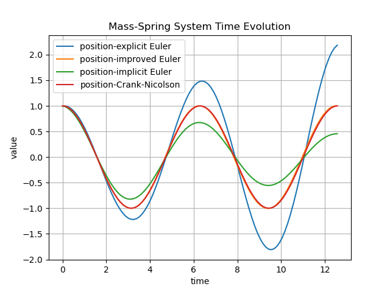
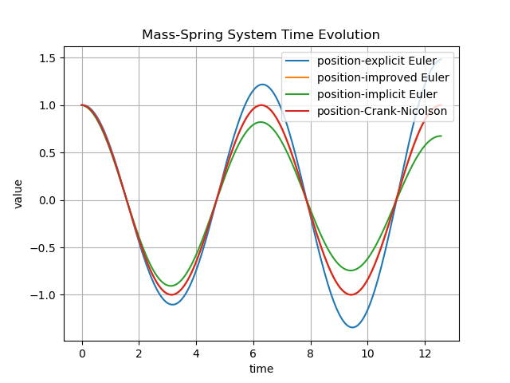
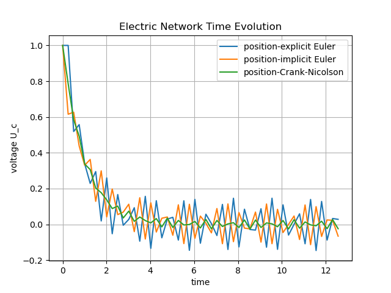
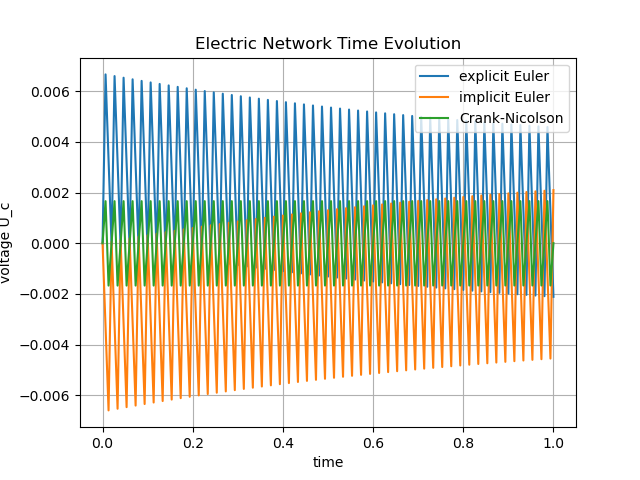
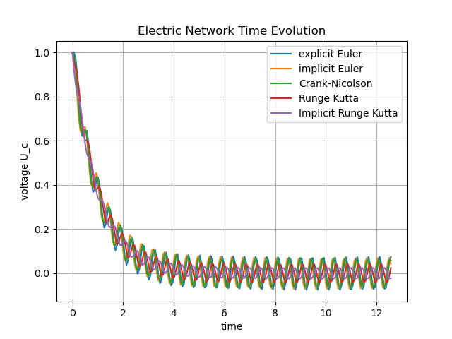
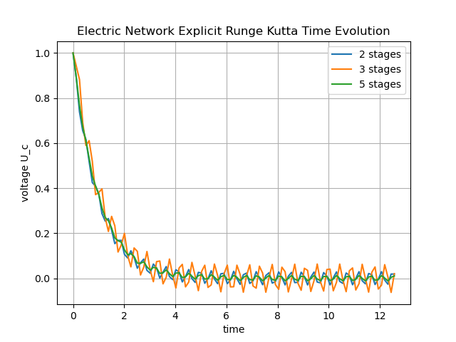
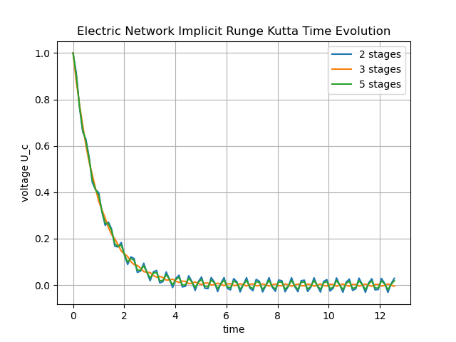

# ASC-ODE – Team 10

A C++ package for solving ordinary differential equations (ODEs), developed in the context of the Numerical Simulation and Scientific Computing I course by Prof. Joachim Schöberl at TU Wien.

This repository is a **Team 10 fork** of the upstream project [ASC-ODE](https://morasched.github.io/intro.html). 

The repository contains:

- Time-stepping schemes for ODEs (Euler variants, implicit Runge–Kutta),
- Model problems (mass–spring system and RC circuit / electric network),
- An automatic differentiation module,
- Plotting scripts and generated plots under `outputs/` and `outputs/plots/`.

---

## Team

We are **Team 10**.

- *Stefan Moser* – `<e12025955@tuwien.ac.at>`
- *Jan Pup Csongor* – `<email2@tuwien.ac.at>`
- *Adam Moritz Rasched* – `<e01644619@student.tuwien.ac.at>`

(#TODO Replace `email1`, `email2` )

---

## Project Scope and Tasks

The goal of this project is to implement and analyze numerical methods for ODEs as described in the course’s jupyterbook:

- [`Overview and theory`](https://jschoeberl.github.io/IntroSC/ODEs/ODEs.html)

Our work corresponds to the following concrete jupyterbook sections:

- **Explicit and Improved Euler – Exercise 1**  
  Mass–spring system with explicit and improved Euler:
  - [`Theory & implementation`](https://jschoeberl.github.io/IntroSC/ODEs/implementation_ee.html)  
  - [`Exercises`](https://jschoeberl.github.io/IntroSC/ODEs/implementation_ee.html#exercise)

- **Implicit Euler and Crank–Nicolson – Exercise 1**  
  Implicit methods applied to the mass–spring system:
  - [`Theory & implementation`](https://jschoeberl.github.io/IntroSC/ODEs/implementation_ie.html)  
  - [`Exercises (mass–spring)`](https://jschoeberl.github.io/IntroSC/ODEs/implementation_ie.html#excercises)

- **Electric Network – Exercise 2**  
  Modeling an electric network (RC/RLC-type system) as an ODE:
  - [`Electric network exercise (last task in block)`](https://jschoeberl.github.io/IntroSC/ODEs/implementation_ie.html#excercises)

- **Automatic Differentiation – Exercise 2**  
  AD and its application to Legendre polynomials and the pendulum:
  - [`AD theory & implementation`](https://jschoeberl.github.io/IntroSC/ODEs/implementation_ad.html)  
  - [`AD exercises (Legendre polynomials, pendulum)`](https://jschoeberl.github.io/IntroSC/ODEs/implementation_ad.html#exercises)  
  - [`Pendulum AD exercise`](https://jschoeberl.github.io/IntroSC/ODEs/implementation_ad.html#exercise-test-the-autodiff-class-for-the-pendulum)

- **Runge–Kutta methods – Exercise 2**  
  Higher-order (implicit and explicit) RK schemes:
  - [`RK theory & implementation`](https://jschoeberl.github.io/IntroSC/ODEs/RungeKutta.html)  
  - [`RK exercises`](https://jschoeberl.github.io/IntroSC/ODEs/RungeKutta.html#exercises)

Our Team 10 implementation focuses on:

1. **Time-Stepping for Linear ODEs (mass–spring system)**  
   (Based on the exercises in the explicit and implicit Euler sections above.)
   - Using different step counts (step sizes) to study stability and accuracy.
   - Generating phase and position–time plots.

2. **Modeling an Electric Network (RC system)**  
   (Based on the electric network exercise in the implicit Euler / Crank–Nicolson chapter.)  
   - Implementing and solving a first-order ODE describing an electric network.
   - Comparing different steppers and producing time-domain voltage plots.

3. **Automatic Differentiation (AD)**  
   (Based on the AD chapter and exercises.)  
   - Extending and using an `AutoDiff` class.
   - Computing Legendre polynomials and their derivatives, including visualization.

4. **Implicit Runge–Kutta Methods**  
   (Based on the Runge–Kutta chapter and exercises.)  
   - Implementing implicit RK schemes using quadrature information.
   - Using them as time-stepping methods via a generic timestepper framework.

All numerical results and figures we use in the documentation are stored in:

- Text / numeric outputs: `outputs/`
- Generated figures:
  - `outputs/plots/` (mass–spring, Legendre, etc.)
  - `outputs/ElectricNetwork/plots/` (electric network / RC circuit)

---

## Repository Structure

This section lists the most relevant files for Team 10.

### Top-Level

- `CMakeLists.txt` – Main CMake build configuration.
- `LICENSE` – MIT license (inherited from upstream).
- `README.md` – This documentation.

### Source Code (`src/`)

- [`src/CMakeLists.txt`](https://github.com/Stefmeff/ASC-ODE-team-10/blob/main/src/CMakeLists.txt)  
  Adds the core sources to the build and configures the library/executables.

- [`src/timestepper.hpp`](https://github.com/Stefmeff/ASC-ODE-team-10/blob/main/src/timestepper.hpp)  
  Generic interface and implementations for time-stepping schemes.  
  Provides the abstraction used by our test drivers (e.g. `test_ode.cpp`).

- [`src/implicitRK.hpp`](https://github.com/Stefmeff/ASC-ODE-team-10/blob/main/src/implicitRK.hpp)  
  Implementation of **implicit Runge–Kutta** methods.  
  - Theory: Runge–Kutta methods based on Gauss-type quadrature  
    ([`Runge–Kutta chapter`](https://jschoeberl.github.io/IntroSC/ODEs/RungeKutta.html)).  
  - Encodes Butcher tableaus for implicit schemes.
  - Integrates with `timestepper.hpp` to define specific RK steppers.

- [`src/autodiff.hpp`](https://github.com/Stefmeff/ASC-ODE-team-10/blob/main/src/autodiff.hpp)  
  Template-based **automatic differentiation** class.  
  - Related theory & exercises:  
    [`AD implementation`](https://jschoeberl.github.io/IntroSC/ODEs/implementation_ad.html)  
    [`AD exercises`](https://jschoeberl.github.io/IntroSC/ODEs/implementation_ad.html#exercises)  
  - Used for computing Legendre polynomials and nonlinear derivatives.
  - Includes operator overloads and elementary functions for AD types.

- [`src/nonlinfunc.hpp`](https://github.com/Stefmeff/ASC-ODE-team-10/blob/main/src/nonlinfunc.hpp)  
  Nonlinear functions and ODE right-hand sides.  
  Contains, among other things, helper functions for:
  - Mass–spring dynamics (as in the Euler exercises),
  - Electric network / RC model (as in the electric network exercise),
  - Functions used for AD-based tests.

- [`src/Newton.hpp`](https://github.com/Stefmeff/ASC-ODE-team-10/blob/main/src/Newton.hpp)  
  A **Newton method** implementation for solving nonlinear systems arising from:
  - Implicit time-stepping schemes (implicit Euler, Crank–Nicolson),
  - Implicit Runge–Kutta stages.  
  Newton’s method is used as in the implicit method implementations of the jupyterbook.

### Demos and Drivers (`demos/`)

- [`demos/test_ode.cpp`](https://github.com/Stefmeff/ASC-ODE-team-10/blob/main/demos/test_ode.cpp)  
  Main **test driver** for solving ODEs with various steppers and systems.  
  - Implements and combines the ideas from:
    - [`Explicit Euler & Improved Euler exercises`](https://jschoeberl.github.io/IntroSC/ODEs/implementation_ee.html#exercise),
    - [`Implicit Euler & Crank–Nicolson exercises`](https://jschoeberl.github.io/IntroSC/ODEs/implementation_ie.html#excercises),
    - [`Runge–Kutta exercises`](https://jschoeberl.github.io/IntroSC/ODEs/RungeKutta.html#exercises).

- [`demos/demo_autodiff.cpp`](https://github.com/Stefmeff/ASC-ODE-team-10/blob/main/demos/demo_autodiff.cpp)  
  Demonstrates the use of `autodiff.hpp` (section *Automatic Differentiation*):  
  - Constructs AD variables,
  - Evaluates functions and extracts derivatives,
  - Generates data used in Legendre polynomial plots, as in the  
    [`AD exercises`](https://jschoeberl.github.io/IntroSC/ODEs/implementation_ad.html#exercises).

- [`demos/electric_ode.cpp`](https://github.com/Stefmeff/ASC-ODE-team-10/blob/main/demos/electric_ode.cpp)  
  C++ demo for the **electric network / RC circuit ODE**:  
  - Implements the model from the  
    [`electric network exercise`](https://jschoeberl.github.io/IntroSC/ODEs/implementation_ie.html#excercises)  
    (last task),
  - Outputs the voltage over time to files under `outputs/ElectricNetwork/`.

### Plotting Scripts (`demos/*.py`)

- [`demos/plotmassspring.py`](https://github.com/Stefmeff/ASC-ODE-team-10/blob/main/demos/plotmassspring.py)  
  - Reads text/CSV files created by `test_ode` for the **mass–spring system**.
  - Produces:
    - Phase diagrams: `massspring_phase_steps*.png`
    - Position–time diagrams: `massspring_position_steps*.png`
  - Saves all plots to `outputs/plots/`.

- [`demos/plotRCcircuit.py`](https://github.com/Stefmeff/ASC-ODE-team-10/blob/main/demos/plotRCcircuit.py)  
  - Reads the numeric output from the electric network demo(s).
  - Plots the **voltage of the electric network / RC circuit** vs. time.
  - Saves resulting figures to `outputs/ElectricNetwork/plots/`.

- [`demos/plotlegendre.py`](https://github.com/Stefmeff/ASC-ODE-team-10/blob/main/demos/plotlegendre.py)  
  - Reads the Legendre polynomial data created by `demo_autodiff.cpp`.
  - Produces:
    - `legendre_polynomials.png`
    - `legendre_polynomials_derivatives.png`
  - Stores plots in `outputs/plots/`.

### Outputs and Plots

- Numeric outputs generated by our simulations are stored under `outputs/` and subfolders.
- Plots for the **mass–spring system** and **Legendre polynomials** live in:  
  [`outputs/plots/`](https://github.com/Stefmeff/ASC-ODE-team-10/tree/main/outputs/plots)
- Plots for the **electric network / RC circuit** are in:  
  [`outputs/ElectricNetwork/plots/`](https://github.com/Stefmeff/ASC-ODE-team-10/tree/main/outputs/ElectricNetwork/plots)

---

## Building the Project

### Requirements

- C++ compiler with C++20 support (e.g. `g++` or `clang++`),
- CMake (≥ 3.x),
- Python 3 with `numpy` and `matplotlib` (for plotting).

### Clone and Configure

```bash
git clone https://github.com/Stefmeff/ASC-ODE-team-10.git
cd ASC-ODE-team-10

# Initialize submodules (e.g. nanoblas, if present)
git submodule update --init --recursive
```

### Build With CMake

```bash
mkdir build
cd build
cmake ..
make -j
```

This will compile:

- The ODE test driver: `test_ode` (from `demos/test_ode.cpp`),
- The AD demo: `demo_autodiff`,
- The electric network demo: `electric_ode`,
- And any additional executables defined in `CMakeLists.txt`.

---

## Running the Demos

### 1. Mass–Spring System (Euler & Implicit Methods)

The mass–spring system and the associated time-stepping methods (Explicit Euler, Improved Euler, Implicit Euler, Crank–Nicolson) correspond to:

- [`Explicit / Improved Euler exercises`](https://jschoeberl.github.io/IntroSC/ODEs/implementation_ee.html#exercise)  
- [`Implicit Euler / Crank–Nicolson exercises (mass–spring)`](https://jschoeberl.github.io/IntroSC/ODEs/implementation_ie.html#excercises)

We study how the solution quality changes with the **number of time steps** (`N`).

From the `build/` directory, run (adapt flags to your actual CLI):

```bash
./test_ode                # default: base configuration, e.g. N = 100
./test_ode --steps 50     # fewer steps (larger Δt)
./test_ode --steps 150    # more steps (smaller Δt)
./test_ode --steps 200
```

These runs produce data files under `outputs/`, for example:

- `outputs/massspring_steps50.txt`
- `outputs/massspring_steps100.txt`
- `outputs/massspring_steps150.txt`
- `outputs/massspring_steps200.txt`

#### Plotting the Mass–Spring Results

From the repository root (or `build`, depending on your script’s expectations):

```bash
python demos/plotmassspring.py
```

The script reads the mass–spring data from `outputs/` and writes plots to `outputs/plots/`, such as:

- Phase plots:
  - `outputs/plots/massspring_phase_steps50.png`
  - `outputs/plots/massspring_phase_steps100.png`
  - `outputs/plots/massspring_phase_steps150.png`
  - `outputs/plots/massspring_phase_steps200.png`
- Position–time plots:
  - `outputs/plots/massspring_position_steps50.png`
  - `outputs/plots/massspring_position_steps100.png`
  - `outputs/plots/massspring_position_steps150.png`
  - `outputs/plots/massspring_position_steps200.png`

#### Mass–Spring Results and Discussion

To visualize the effect of different step numbers, we include the following plots:

- **Base configuration (e.g. 100 steps):**  

  
  

- **Fewer steps (50 steps):**  

  
  

- **More steps (150 and 200 steps):**

  
  
  
  

The qualitative behavior matches the theoretical discussion in the explicit and implicit method sections:

- With **coarse time steps** (few steps), local truncation errors are large, and phase plots depart significantly from the ideal circle (as in the explicit Euler discussion).
- With **finer time steps**, the phase diagrams become circular and amplitude is better conserved.
- Implicit Euler and Crank–Nicolson-type methods show improved stability for longer simulations, in line with the jupyterbook exercises.

---

### 2. Electric Network / RC Circuit

The electric network / RC circuit model and related exercise are described in:

- [`Electric network exercise (last task)`](https://jschoeberl.github.io/IntroSC/ODEs/implementation_ie.html#excercises)

To simulate the electric network / RC circuit, run (from `build/`):

```bash
./electric_ode
```

(If your electric network is instead run via `test_ode`, adapt to the correct CLI, e.g. `./test_ode --rhs electric_network`.)

The program writes time-series data for the network voltage into `outputs/ElectricNetwork/`, e.g.:

- `outputs/ElectricNetwork/voltage_steps50.txt`
- `outputs/ElectricNetwork/voltage_steps100.txt`
- `outputs/ElectricNetwork/voltage_steps150.txt`
- `outputs/ElectricNetwork/voltage_steps200.txt`

Then, generate plots with:

```bash
python demos/plotRCcircuit.py
```

This produces figures in `outputs/ElectricNetwork/plots/`, including:

- `outputs/ElectricNetwork/plots/voltage_plot_steps50.png`
- `outputs/ElectricNetwork/plots/voltage_plot_steps100.png`
- `outputs/ElectricNetwork/plots/voltage_plot_steps150.png`
- `outputs/ElectricNetwork/plots/voltage_plot_steps200.png`

Additionally, we generate comparison plots for specific steppers, e.g.:

- `outputs/ElectricNetwork/plots/ExplicitRunge_voltage_plot_steps100.png`
- `outputs/ElectricNetwork/plots/ImplicitRunge_voltage_plot_steps100.png`

#### Electric Network Results and Discussion

Representative voltage plots:

- **Base configuration (100 steps):**

  

- **Fewer steps (50):**

  

- **More steps (150, 200):**

  
  

Comparison of explicit vs. implicit RK at 100 steps:

- **Explicit RK:**

  

- **Implicit RK:**

  

These results illustrate the behavior discussed in the electric network and Runge–Kutta exercises:

- For **sufficiently small time steps**, the numerical voltage curve closely follows the analytical evolution derived in the electric network exercise.
- Coarser time steps increase numerical error and, for explicit methods, may cause visible deviations.
- Implicit RK methods provide improved robustness and stability for stiffer network parameters, consistent with the RK theory.

---

### 3. Automatic Differentiation & Legendre Polynomials

Automatic differentiation and its exercises are presented in:

- [`AD implementation`](https://jschoeberl.github.io/IntroSC/ODEs/implementation_ad.html)  
- [`AD exercises (Legendre, pendulum)`](https://jschoeberl.github.io/IntroSC/ODEs/implementation_ad.html#exercises)  
- [`Pendulum AD exercise`](https://jschoeberl.github.io/IntroSC/ODEs/implementation_ad.html#exercise-test-the-autodiff-class-for-the-pendulum)

Our implementation in `autodiff.hpp` follows this approach.

Run the AD demo:

```bash
./demo_autodiff
```

This generates a data file in `outputs/`, e.g.:

- `outputs/legendre_data.csv`

Then plot Legendre polynomials and their derivatives:

```bash
python demos/plotlegendre.py
```

Resulting figures in `outputs/plots/`:

- [`legendre_polynomials.png`](https://github.com/Stefmeff/ASC-ODE-team-10/blob/main/outputs/plots/legendre_polynomials.png)
- [`legendre_polynomials_derivatives.png`](https://github.com/Stefmeff/ASC-ODE-team-10/blob/main/outputs/plots/legendre_polynomials_derivatives.png)

#### Legendre Results and Discussion

We embed the two main Legendre plots below:


As in the AD exercises:

- The polynomial shapes \( $P_n(x)$ \) and their zeros match the theoretical Legendre polynomials on \([-1, 1]\).
- The derivatives \( $P_n'(x)$ \) show the expected number of zeros and symmetry.
- This confirms that our `AutoDiff` class and operator overloads correctly implement forward-mode AD, in line with the examples in the jupyterbook.

---

## Summary of Numerical Observations

- **Mass–Spring System (Explicit/Implicit Euler & Crank–Nicolson):**  
  Refining the number of steps (reducing the time step) systematically improves the phase and position–time plots. The numerical behavior matches the theoretical analysis and exercises from the explicit and implicit method sections.

- **Electric Network:**  
  The ODE solver reproduces the expected voltage evolution of the network, as in the electric network exercise. Implicit RK methods provide additional robustness for stiff configurations.

- **Automatic Differentiation:**  
  AD-based evaluation of Legendre polynomials and their derivatives produces plots that match the known analytical behavior, validating our AD implementation against the AD chapter and exercises.

---

## License

This project is licensed under the MIT License.  
See [`LICENSE`](https://github.com/Stefmeff/ASC-ODE-team-10/blob/main/LICENSE) for details.
