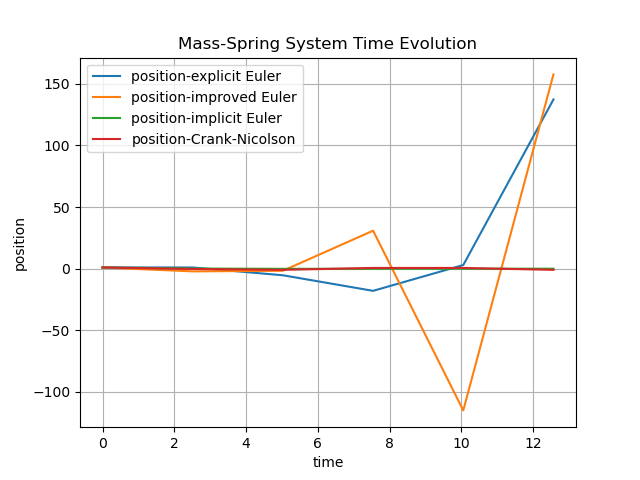
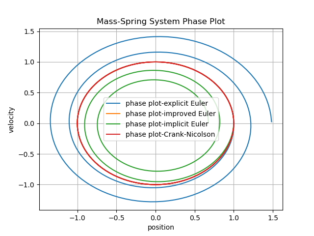

# 3. Applications:

In this chapter, we demonstrate the usage of our ODE library by simulating **mechanical and electrical systems**, simulating their temporal behaviour by numerically solving their underlying ODE's.


## 3.1 Mass-Spring System

We start with a **simple mechanical system**: a mass attached to a spring. Using Newton’s law:
$$my''(t) = -ky(t)$$
where **m** is the mass, **k** the stiffness of the spring, and *y(t)* the displacement of the mass.  We express this relationship as a first order system:

$$\begin{bmatrix} y \\ y' \end{bmatrix}' = \begin{bmatrix} y' \\ -\frac{k}{m}y \end{bmatrix}$$

The system is implemented in `demos/test_ode` as the `MassSpring` class, which evaluates the RHS for any given state. Using our different time-stepping methods we can calculate and plot the change in position over time and the phase plot. To execute the code, compile it as stated in the intro and call:
```
 ./test_ode [--system <type>] [--method <name>] [--stages N]
```
Where the command line options are:
- s: MassSpring, ElectricNetwork
- m: ExplicitEuler, ImplicitEuler, ImprovedEuler, CrankNicolson, ExpRungeKutta,ImpRungeKutta
- k: Number of stages for Runge-Kutta methods

e.g.:
```
./test_ode -s MassSpring -m ExplicitEuler
```
After calculating the results for the different time-stepping methods (*Explicit-, Implicit-, Improved-Euler* and *Crank-Nicolson*), we can see their respective behaviour using different number of steps **s** in the plots below:

- **Time-Stepping Methods (5 steps):**

  
  

- **Time-Stepping Methods (50 steps):**

  
  

- **Time-Stepping Methods (200 steps):**

  
  

As one can see in the plots above, low stepsizes lead to really rough approximations of the solution. As step size increases the results get more and more accurate. One can also compare the results across methods. As one can see *Improved Euler* or *Crank-Nicolson* provide a much better approximation of the real solution (which would be a periodically swinging mass) than for example *Explicit Euler*, which swings with increasing amplitude as time progesses.

## 3.2 Electronic Circuit

As a second example we look at a simple RC circuit. By Kirchhoff's law, the voltage $U_C(t)$ across the capacitor satisfies:

$$RC\frac{dU_C}{dt} + U_C(t) = U_0(t)$$

where **R** is the resistance, **C** is the capacitance, and $U_0(t)$ is the input voltage. Rearranging as a first-order ODE:

$$\frac{dU_C}{dt} = \frac{1}{RC}(U_0(t) - U_C(t))$$

<p align="center">

</p>


The system is implemented in `demos/test_ode.cpp` as the `ElectricNetwork` class. Parameters are set to $R=C=1$ and the input voltage is $U_0(t) = \cos(100\pi t)$. Since the RC-circuit implements a low pass filter, we expect high-frequent input signals to decrease in amplitude at the output. We simulate the systems behaviour again by calling:

```
./test_ode -s ElectricNetwork [--method <name>] [--stages N]
```

**Time-Stepping Methods (50 steps):** | **Time-Stepping Methods (100 steps):**
:---:|:---:
 | 


**Time-Stepping Methods (200 steps):** | **Time-Stepping Methods (20000 steps):**
:---:|:---:
 | 

We can see that the performance for a low number of steps leads to really bad performance in this case. This is because the larger stepsizes produce errors for both 
numerical approximation and plotting the values of a function with a high frequency.
In oder to accurately capture a signal with a frequency of $f_{max}=100\pi$ we need to consider **Nyquist Criterion**, were the sampling rate $f_s$ for a signal of frequence $f_{max}$ needs to be at least:
$$f_s \geq 2*f_{max}$$

For a n=20000 steps, we see a accurate represantation of the output signal $U_C(t)$, which is a signal of the same frequency, but highly reduced in amplitude. We can also see the same behaviour for explicit and implicit Runge Kutta for different number of stages:

**Time-Stepping Methods (20000 steps):** | **Time-Stepping Methods (20000 steps):**
:---:|:---:
 | 

## 3.3 Legendre Polynomials

We demonstrate the usage of the class `AutoDiff`, by expressing the Legendre-polynomials up to order 5 in intervall $-1 \leq x \leq 1$ and evaluating the values and derivatives. We implement the evaluation of the values and derivates in the file `demos/demo_autodiff.cpp`, and store the results at the discrete points x in a text file.

```cpp
    std::ofstream outfile("../outputs/Legendre/legendre_polynomials.txt");
    for (double x = -1.0; x <= 1.0; x += 0.01) {
        AutoDiff<1> adx = Variable<0>(x);
        std::vector<AutoDiff<1>> P;
        LegendrePolynomials(5, adx, P);
        outfile << x;
        for (size_t i=0; i<P.size(); ++i) {
            outfile << "," << P[i].value() << "," << P[i].deriv()[0];
        }
        outfile << "\n";
    }
    outfile.close();
```
If we execute `plotlegendre.py` we can view the legendre Polynomials up to order 5 and its derivatives.

**Legendre Polynomials:** | **Derivative:**
:---:|:---:
 | 


# 3.4 Mass-Spring Pendulum

For this example, we want to simulate the behaviour of mass-spring systems, where point masses are connected to each other with springs or mass-less sticks. For this we utilize the class `MassSpringSystem` implemented in `mechsystem/mass_spring.cpp`. This class represents a mechanical system of interconnected point masses and fix points. The class `MSS_Functions` implements the right-hand-side function for the mass-spring system and can be used to numerically approximate and simulate the systems behaviour.

To calculate the forces on the point masses **$m_i$** with position $x_i(t)$, we first consider the potential energy **U(x)**:
$$\sum_i m_i\,g x_{i,z},$$

For the energy stored in the spring $k_ij$ connecting point masses $m_i$ and $m_j$ we get:

$$\sum_{k_{ij}} \frac{1}{2} k_{ij} ( |x_i - x_j | - l_{ij} )^2,
$$

The force acting on a mass can then be expressed as:
$$
F_i := -\frac{\partial U}{\partial x_i}(x)
$$

Dividing the force my the mass gives us the accelleration. If we assume mass-less sticks of length **l** connecting the point masses, we get the following constraint:
$$
0 = g(x) := | x - x_0 | - l,
$$
We can then define the Lagrange function:
$$
L(x, \lambda) = -U(x) + \left< \lambda , g(x) \right>
$$
and derive the equation:
$$\begin{aligned}
m_i\ddot x_i &= \frac{\partial}{\partial x_i} L(x, \lambda) \\
0 &= \nabla_\lambda L(x, \lambda)
\end{aligned}$$

We can then define such mechinal systems like this:

```cpp
MassSpringSystem<2> mss;
mss.setGravity( {0,-9.81} );
auto fA = mss.addFix( { { 0.0, 0.0 } } );
auto mA = mss.addMass( { 1, { 1.0, 0.0 } } );
auto mB = mss.addMass( { 1, { 2.0, 0.0 } } );

mss.add (Spring(1, 20000, (fA, mA)))
mss.add (DistanceConstraint(1,(mA,mB)))
```
By again implementing the right-hand side function of the mass spring system as  a `NonlinearFunction` in `MSS_Functions`, allows us to use numerical methods to approximate the systems behaviour.

```cpp
template <int D>
class MSS_Function : public NonlinearFunction
{
  MassSpringSystem<D> & mss;
public:
  MSS_Function (MassSpringSystem<D> & _mss)
    : mss(_mss) { }

  virtual size_t dimX() const override;
  virtual size_t dimF() const override;

  virtual void evaluate(VectorView<double> x, VectorView<double> f) const override;
  virtual void evaluateDeriv(VectorView<double> x, MatrixView<double> df) const override;
}

```


**Double Pendulum** | **Spring Chain:**
:---:|:---:
 | 

TODO: Simulate other more complicated constructs using distance constraints via Lagrange multipliers.


